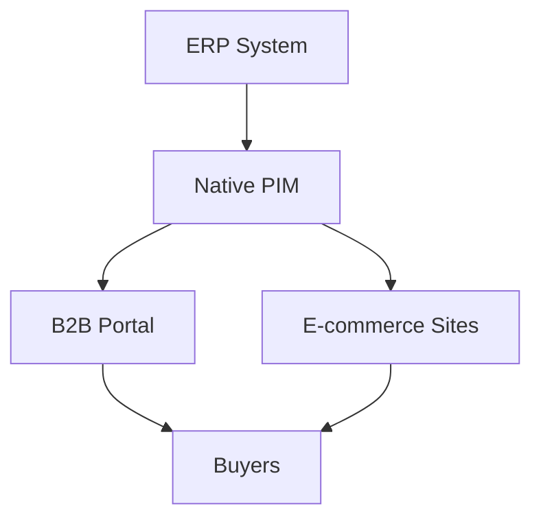

## Overview

B2Bware delivers a complete B2B commerce platform designed for manufacturers, distributors, and wholesalers. You gain ERP-deep accuracy with features like tiered pricing, unified product data, real-time synchronization, and seamless self-service portals. These capabilities eliminate manual processes and provide buyers with an intuitive experience.

<Callout kind="info">
B2Bware integrates directly with your ERP system, ensuring data consistency across ordering, inventory, and catalogs.
</Callout>

## Key Features

Discover the core capabilities that power your B2B operations.

<Columns cols={2}>
  <Card title="Tiered Pricing & Contract Catalogs" icon="dollar-sign" href="#tiered-pricing">
    Set dynamic pricing based on customer tiers and contracts. Buyers see personalized catalogs without manual updates.
  </Card>
  <Card title="Unified Product Data" icon="database" href="#unified-data">
    Maintain consistent product information across all sales channels and sites from a single source.
  </Card>
  <Card title="Real-Time Sync" icon="zap" href="#real-time-sync">
    Sync orders and inventory instantly between your ERP and buyer portals.
  </Card>
  <Card title="Self-Service Portals" icon="users" href="#self-service">
    Enable buyers to place orders, check stock, and manage accounts independently.
  </Card>
</Columns>

## Tiered Pricing and Contract Catalogs

Configure tiered pricing to reflect customer contracts automatically. You define volume discounts, custom rates, and access levels per buyer group.

<Tabs>
  <Tab title="Basic Setup" icon="settings">
    Use the dashboard to create pricing rules.
    
    <Steps>
      <Step title="Define Tiers" icon="list">
        Navigate to Pricing > Tiers and add groups like "Gold" or "Standard".
      </Step>
      <Step title="Assign Contracts" icon="file-text">
        Link contracts to customer accounts for automatic application.
      </Step>
      <Step title="Test Pricing" icon="play">
        Preview catalogs to verify tiered rates.
      </Step>
    </Steps>
  </Tab>
  <Tab title="Advanced Rules" icon="code">
    Customize with API for complex logic.
    
````jsx
<CodeGroup tabs="JavaScript,Python">
```javascript
// Fetch tiered pricing for a customer
const response = await fetch('https://api.example.com/v1/pricing/tiers?customerId=YOUR_CUSTOMER_ID', {
  headers: { Authorization: `Bearer ${YOUR_API_KEY}` }
});
const tiers = await response.json();
```
```python
import requests

response = requests.get(
    'https://api.example.com/v1/pricing/tiers',
    params={'customerId': 'YOUR_CUSTOMER_ID'},
    headers={'Authorization': f'Bearer {YOUR_API_KEY}'}
)
tiers = response.json()
```
</CodeGroup>
````
  </Tab>
</Tabs>

<ParamField path="customerId" param-type="string" required="true">
Customer identifier from your ERP.
</ParamField>

## Unified Product Data Management

Centralize product data to ensure accuracy across portals, websites, and apps. Changes in your ERP propagate instantly.



<Expandable title="Data Synchronization Details" default-open="false">
Synchronize attributes like SKUs, descriptions, images, and pricing. Use webhooks for custom fields.

<CodeGroup tabs="cURL,JavaScript">
```bash
curl -X POST https://api.example.com/v1/products/sync \
  -H "Authorization: Bearer YOUR_API_KEY" \
  -d '{"sku": "ABC123", "price": 29.99}'
```
```javascript
await fetch('https://api.example.com/v1/products/sync', {
  method: 'POST',
  headers: { 'Authorization': `Bearer ${YOUR_API_KEY}` },
  body: JSON.stringify({ sku: 'ABC123', price: 29.99 })
});
```
</CodeGroup>
</Expandable>

## Real-Time Order and Inventory Sync

Keep inventory and orders in sync without delays. Process changes as they occur in your ERP.

<Callout kind="tip">
Enable webhooks in your ERP settings to trigger instant updates in B2Bware.
</Callout>

<Request tabs="cURL,JavaScript" show-lines="true">
````bash
curl -X POST https://api.example.com/v1/orders \
  -H "Content-Type: application/json" \
  -H "Authorization: Bearer YOUR_API_KEY" \
  -d '{
    "orderId": "ORD-456",
    "items": [{"sku": "ABC123", "qty": 10}],
    "status": "confirmed"
  }'
````

````javascript
const orderData = {
  orderId: 'ORD-456',
  items: [{ sku: 'ABC123', qty: 10 }],
  status: 'confirmed'
};

await fetch('https://api.example.com/v1/orders', {
  method: 'POST',
  headers: {
    'Content-Type': 'application/json',
    'Authorization': `Bearer ${YOUR_API_KEY}`
  },
  body: JSON.stringify(orderData)
});
````
</Request>

<Response tabs="200,400">
````json
{
  "orderId": "ORD-456",
  "status": "synced",
  "inventoryUpdated": true
}
````

````json
{
  "error": "Invalid SKU",
  "details": "ABC123 not found"
}
````
</Response>

## Seamless Self-Service Buyer Experience

Buyers access personalized portals for ordering, tracking, and reordering. You reduce support tickets with intuitive interfaces.

| Feature | Benefit |
|---------|---------|
| Quick Reorder | One-click from order history |
| Stock Visibility | Real-time availability checks |
| Custom Catalogs | Tailored to buyer contracts |
| Mobile Responsive | Access from any device |

## Next Steps

<Card title="Get Started" icon="rocket" href="/quickstart">
Follow the quickstart guide to set up your first portal.
</Card>

<Card title="API Reference" icon="code" href="/authentication">
Integrate with our API using secure authentication.
</Card>

<Callout kind="success">
Ready to implement? Schedule a consultation to tailor B2Bware to your ERP.
</Callout>