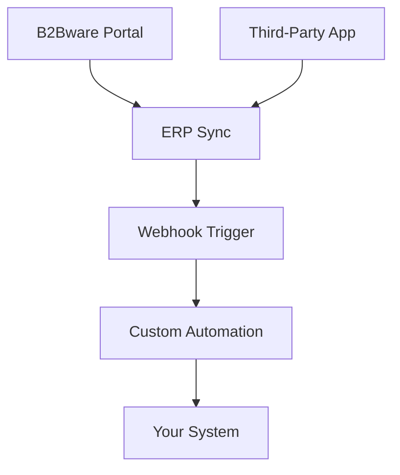

## Overview

B2Bware provides seamless integrations with leading ERP systems and third-party applications. You can synchronize orders, inventory, and customer data in real-time, eliminating manual data entry. This guide covers supported systems, setup processes, and custom webhook automation.

<Callout kind="info">
B2Bware supports native connectors for popular ERPs. For unsupported systems, use our API or webhooks.
</Callout>

## Supported ERP Systems

Connect B2Bware directly to your ERP for automatic data sync.

<Columns cols={3}>
  <Card title="SAP" icon="database" href="#sap-setup">
    Real-time inventory and order sync with SAP S/4HANA.
  </Card>
  <Card title="NetSuite" icon="settings" href="#netsuite-setup">
    Full bidirectional integration for financials and fulfillment.
  </Card>
  <Card title="Dynamics 365" icon="bar-chart" href="#dynamics-setup">
    Seamless connection for Microsoft Dynamics users.
  </Card>
</Columns>

<Columns cols={3}>
  <Card title="QuickBooks" icon="package" href="/quickstart">
    Simple accounting sync for small to medium businesses.
  </Card>
  <Card title="Oracle ERP" icon="cloud" href="#oracle-setup">
    Enterprise-grade integration with advanced customization.
  </Card>
  <Card title="Custom API" icon="code" href="#api-setup">
    Build your own connector using REST APIs.
  </Card>
</Columns>

## Setting Up ERP Integrations

Follow these steps to connect your ERP.

<Steps>
  <Step title="Create Integration" icon="plus">
    Log in to your B2Bware dashboard at `https://dashboard.example.com`.

    Navigate to **Integrations > ERP Connectors**.

    Click **Add New Integration** and select your ERP.
  </Step>
  <Step title="Configure Credentials" icon="key">
    Enter your ERP credentials:

    <ParamField header="Authorization" param-type="string" required="true">
      Bearer token from your ERP provider.
    </ParamField>

    <ParamField query="sync_mode" param-type="string" required="false">
      Choose `full` or `incremental`.
    </ParamField>
  </Step>
  <Step title="Test Connection" icon="check-circle">
    Run a test sync to verify data flow.

````bash
curl -X POST https://api.example.com/b2bware/v1/integrations/test \
  -H "Authorization: Bearer YOUR_API_KEY" \
  -d '{"erp": "sap"}'
````
  </Step>
  <Step title="Enable Automation" icon="zap">
    Schedule syncs (e.g., every 15 minutes) and monitor in the dashboard.
  </Step>
</Steps>

## Third-Party App Connections

Integrate with e-commerce platforms, shipping providers, and analytics tools via pre-built connectors or APIs.

<Tabs>
  <Tab title="Shopify" icon="shopping-cart">
    Sync products and orders automatically.

    <CodeGroup tabs="JavaScript,Python">
````javascript
const response = await fetch('https://api.example.com/b2bware/v1/integrations/shopify/sync', {
  method: 'POST',
  headers: { 'Authorization': 'Bearer YOUR_API_KEY' },
  body: JSON.stringify({ shop_id: 'your-shop-id' })
});
````
````python
import requests
response = requests.post(
    'https://api.example.com/b2bware/v1/integrations/shopify/sync',
    headers={'Authorization': 'Bearer YOUR_API_KEY'},
    json={'shop_id': 'your-shop-id'}
)
````
    </CodeGroup>
  </Tab>
  <Tab title="ShipStation" icon="truck">
    Automate shipping label generation and tracking updates.
  </Tab>
  <Tab title="Google Analytics" icon="activity">
    Track B2B portal performance and conversions.
  </Tab>
</Tabs>

## Webhooks for Custom Automation

Use webhooks to trigger actions on events like new orders or inventory changes.

### Webhook Setup

1. In the dashboard, go to **Integrations > Webhooks > Add Webhook**.
2. Set the target URL to `https://your-webhook-url.com/b2bware`.
3. Select events (e.g., `order.created`, `inventory.updated`).

### Example Payload

```json
{
  "event": "order.created",
  "data": {
    "id": "ord_12345",
    "customer_id": "cust_67890",
    "total": 1500.00
  },
  "timestamp": "2024-01-15T10:30:00Z"
}
```

<Request tabs="cURL,JavaScript" show-lines="true">
````bash
curl -X POST https://api.example.com/b2bware/v1/webhooks \
  -H "Authorization: Bearer YOUR_API_KEY" \
  -H "Content-Type: application/json" \
  -d '{
    "url": "https://your-webhook-url.com/b2bware",
    "events": ["order.created"]
  }'
````
````javascript
await fetch('https://api.example.com/b2bware/v1/webhooks', {
  method: 'POST',
  headers: {
    'Authorization': 'Bearer YOUR_API_KEY',
    'Content-Type': 'application/json'
  },
  body: JSON.stringify({
    url: 'https://your-webhook-url.com/b2bware',
    events: ['order.created']
  })
});
````
</Request>

## Integration Flow



<Expandable title="Troubleshooting Common Issues" default-open="false">
- **Connection Failed**: Verify credentials and firewall settings.
- **Sync Delays**: Check rate limits in your ERP.
- **Payload Errors**: Validate JSON format against our schema.

<Callout kind="tip">
Monitor integration logs in the dashboard for detailed error messages.
</Callout>
</Expandable>

## Next Steps

Explore advanced configurations or contact support for custom integrations. Link to [Authentication](/authentication) for API key setup.